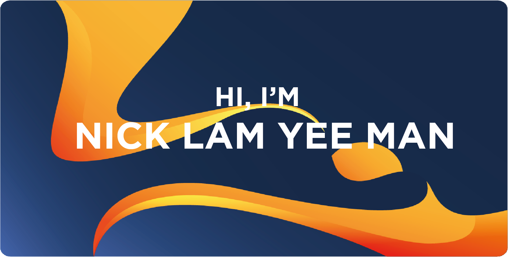

<!---
nicklamyeeman/nicklamyeeman is a ✨ special ✨ repository because its `README.md` (this file) appears on your GitHub profile.
You can click the Preview link to take a look at your changes.
--->

#### Hey there 👋

I'm **Nick**, I'm 24 years old and I'm a computer science student at Epitech school. I'm about to graduate and I'm passionate about 🎮 **video games** and 🧮 **mathematics**. A passion that I pass on thanks to my current job as a 🧑🏻‍🏫 **teaching assistant** in my school.

I also do *personal projects*, 💻 **computer projects** to make my life easier or 🎨 **artistic projects** to entertain myself.
I like to **speak in public** and I don't hesitate to talk about my ideas in front of different audiences, which allowed me to win 🏆 several idea contests in my region.

# Welcome to my GitHub page

## 📌 Pinned Repositories

<table>
    <tr>
        <td>
            
        </td>
        <td>
            
        </td>
    </tr>
    <tr>
        <td>
            
        </td>
        <td>
            
        </td>
    </tr>
</table>

 

##  CertiFaced

**CertiFaced** is my *graduation project* with <del>seven</del> *six* other Epitech students. Our project consists in bringing help to people suffering from **faceblindness**, that is to say people who are unable to recognize a face.
Just imagine that **every time** you meet someone, you feel like you're meeting them for the **first time** in your life, even if it's **your mom**.

So we developed an **Android** application on **Android Studio** with the **Kotlin** language that serves as a "Proof of Concept" coupling **facial recognition** *(and facial detection)* and using **MLKit** for **augmented reality**.

 

<a href="https://play.google.com/store/apps/details?id=leananas.eip.certifaceds">
    
 

## 💼 Skills

 

More Skills

 

 

 

 

 

 

 

